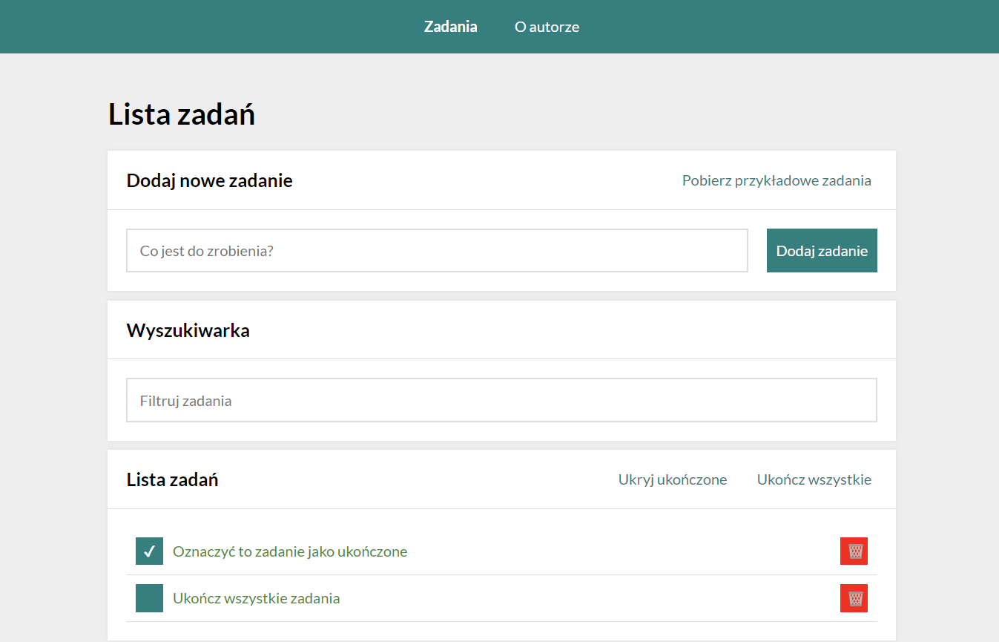

# Task list

## Demo
https://dimairak.github.io/todos-list-react/

Dscription

This project was bootstrapped with [Create React App](https://github.com/facebook/create-react-app).

## Technologies used in this project
- React
- HTML
- CSS with BEM convention
- JavaScript
- MediaQueries
- Grid
- Flex

## Available Scripts

In the project directory, you can run:

### `npm run build`

Builds the app for production to the `build` folder.\
It correctly bundles React in production mode and optimizes the build for the best performance.

The build is minified and the filenames include the hashes.\
Your app is ready to be deployed!

See the section about [deployment](https://facebook.github.io/create-react-app/docs/deployment) for more information.
